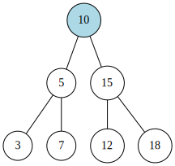

It is a subset of [[Trees]] where it still contains two children, nodes and root node.
- the left value is **less than or equal** to the parent value
- the right value is **strictly greater** than the parent value



<div style="text-align: center">
  BST example
</div>


- As there is a structure in terms of value (greater/less) it is extremely useful for sorting purposes and efficient searching properties.
- Insertion and Deletion of nodes is very efficient (point of interest halves the tree everytime)

For theoretical explanation of tree traversal methods, check [[Tree Traversal Theory]].
## Insertion

 1. Every time we try to insert, we have a condition to check: if `current value <= node value`,  *go left*. If `current value <= node value`, *go right*. Additionally, we need two inputs - **root** and **value to be entered**. 
 
2. Suppose we go either left or right, that node might be empty (non-existent). 
	- In that case, we create a node to insert the value in that child.

3. If the tree has deeper levels, we need to *repeat* the whole process starting from the current node as root
	- In this case we call `insertNode` recursively on the *child* we moved to

```python
def insertNode(self, root, data):
	if root is None:
		root.data = data
	# if data is <= root, it goes left
	elif data <= root.data:
		if root.leftChild is None:
			root.leftChild = BSTNode(data)
		else:
			self.insertNode(root.leftChild, data)
	# if data is > root, it goes right
	else:
		if root.rightChild is None:
			root.rightChild = BSTNode(data)
		else:
			self.insertNode(root.rightChild, data)
```

## Traversal

As mentions in [Tree Traversal Theory](Tree%20Traversal%20Theory.md), we can traverse the BST in four different ways as well:
1. Pre-order
2. Post-order
3. In-order
4. Level-order (or BFS)
As this part is slightly redundant for both trees and BST, find the code and notes in [Tree Traversal Code](Tree%20Traversal%20Code.md).

