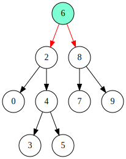
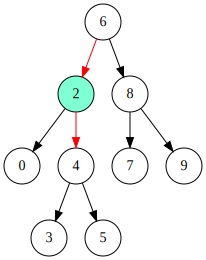
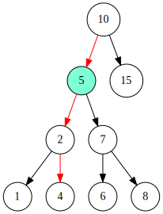

**Difficulty:**  #Medium

---

## Problem Statement

> Given a binary search tree (BST), find the lowest common ancestor (LCA) node of two given nodes in the BST.

According to the definition of LCA on Wikipedia: “The lowest common ancestor is defined between two nodes p and q as the lowest node in T that has both p and q as descendants (where we allow a node to be a descendant of itself).

**Example 1:**



> `Input: root = [6,2,8,0,4,7,9,null,null,3,5], p = 2, q = 8`    
> `Output: 6`
> `Explanation: The LCA of nodes 2 and 8 is 6`

**Example 2:**


> `Input: root = [6,2,8,0,4,7,9,null,null,3,5], p = 2, q = 4`    
> `Output: 2`  
> `Explanation: The LCA of nodes 2 and 4 is 2, since a node can be a descendant of itself according to the LCA definition.`


**Important Constraints:**
- All Node.val are unique.
- The number of nodes in the tree is in the range $[2, 10^5]$
- `p != q`
- p and q will exist in the BST.

[Problem Link](https://leetcode.com/problems/lowest-common-ancestor-of-a-binary-search-tree/description/)

---

## Approach & Explanation


If we really wanted, we could divide the possibilities into three different categories - 
1.	Both nodes are in the left subtree.
2.	Both nodes are in the right subtree.
3.	One node is in the left subtree and the other is in the right subtree.

Lowest means lowest in value. So from the top, the first node that is common to both p and q would be the answer. This essentially means whenever there is a 'break' in flow to the path of finding p and q, we can identify the node. This means :
- Check the direction needed to move towards **both** p and q
- If both in same direction, keep moving until they are not in same direction
- The node at which their path diverges, is the common ancestor
### Case 1: Both Nodes in the Left Subtree

For example, p = 5 and q = 4 in the tree. At the beginning both 4,5 are less than 10 so moves left (same direction). When it reaches 5, 4 is to the left subtree but 5 is *not*. This means a divergence hence 5 is the LCA.


### Case 2: Both nodes in the right subtree

For example, p = 17 and q = 20 in the tree.  At the beginning both 17,20 are greater than 10 so moves right (same direction). When it reaches 20, 17 is to the left subtree but 20 is *not*. This means a divergence hence 20 is the LCA.

%201.svg)
### Case 3: One node is in left subtree other in the right

For example, p = 2 and q = 18 in the tree. At the very first step both are in different directions as one greater other smaller. This means the root (10) itself is the LCA.

.svg)


---

## Solution

```python
# Definition for a binary tree node.
# class TreeNode:
#     def __init__(self, x):
#         self.val = x
#         self.left = None
#         self.right = None

class Solution:
    def lowestCommonAncestor(self, root: 'TreeNode', p: 'TreeNode', q: 'TreeNode') -> 'TreeNode':
        cur = root
        while cur:
            if p.val > cur.val and q.val > cur.val:
                cur = cur.right
            elif p.val < cur.val and q.val < cur.val:
                cur = cur.left
            else:
                return cur
```

### Complexities

**Time Complexity:** $\mathcal{O}(\log(n))$   
**Space Complexity:** $\mathcal{O}(1)$  

We consider the BST is balanced, in which case the max we might need to traverse is the height of the tree which is $\log(n)$ . If the tree was not balanced, however, the complexity could go upto $\mathcal{O}(n)$. For this iterative approach, we only use a single variable to keep track of current node so space complexity would be $\mathcal{O}(1)$ .


---

## Possible Confusion

- The else condition is simply saying if *not in the same direction* then this node is the one