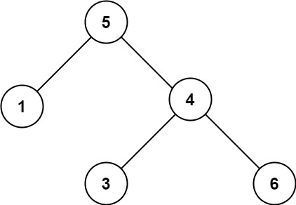

**Difficulty:** #Medium

---

## Problem Statement

> Given the root of a binary tree, determine if it is a valid binary search tree (BST).

A valid BST is defined as follows:

- The left subtree of a node contains only nodes with keys less than the node's key.
- The right subtree of a node contains only nodes with keys greater than the node's key.
- Both the left and right subtrees must also be binary search trees.

**Example 1:**


> `Input: root = [2,1,3]`    
> `Output: true `  

**Example 2:**



> `Input: root = [5,1,4,null,null,3,6]`   
> `Output: false`  

[Problem Link](https://leetcode.com/problems/validate-binary-search-tree/description/)

---

## Approach & Explanation


**Brute Force approach:** We could go to every node, check if all nodes on right are greater and all nodes on left are smaller. For  $n$ nodes, that would mean we do it $n^2$ times, making it very inefficient.

**Better approach:** We can do it in linear time if we keep updating the limits for the node value as we go deeper into the tree. The main approach is to recursively check this both left and right. If either returns `False` we return False to the main call.

Suppose there is a lower limit (left) and upper limit (right). Initially for root, it can be any value so we can set these to $[-\infty, \infty]$ . If we keep going left of any tree, the left limit stays **unchanged.** 


From the example, for 1 the limit is  $[-\infty, 5)$, where 5 is excluded. Only the **right limit** changes to 5. Similarly going right means *right boundary stays same, left changes*. So for 4 the range is  $(5, \infty]$, which is not satisfied. So this should return False.

The base case is if there is no tree (empty tree or end of a tree) then return `True` because it's still valid. As we go through the values, if they do not satisfy the range then they are invalid so return `False`.

---

## Solution

```python
# Definition for a binary tree node.
# class TreeNode:
#     def __init__(self, val=0, left=None, right=None):
#         self.val = val
#         self.left = left
#         self.right = right

class Solution:
    def isValidBST(self, root: Optional[TreeNode]) -> bool:
        # Define a helper function that checks the validity of the BST
        def valid(root, left, right):
            # Base case: If the current node is None, it's a valid subtree
            if root is None:
                return True
            
            # Check the current node's value against the allowed range
            if (root.val <= left) or (root.val >= right):
                return False
            
            # Recursively check the left subtree with an updated upper bound
            # and the right subtree with an updated lower bound
            return valid(root.left, left, root.val) and valid(root.right,
            root.val, right)
        
        # Start the recursion with the full range of possible values
        return valid(root, float("-inf"), float("inf"))
        
```

### Complexities

**Time Complexity:** $\mathcal{O}(n)$   
**Space Complexity:** $\mathcal{O}(n)$  

Every value is compared once, so the solution is linear. *Technically*, for each node we compare it with 2 different values but that doesn't matter much.

---

## Possible Confusion

- The condition `if (root.val <= left) or (root.val >= right):` is simply converse for the condition `if not (root.val > left and root.val < right)`. We can use either for this.
- A helper function is used because the introduction of two new parameters left and right is smoother without interrupting the main function
- You *may* ignore the root node which won't require the use of  $\infty$ in code considering a valid root value will be given.